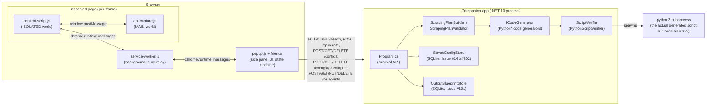
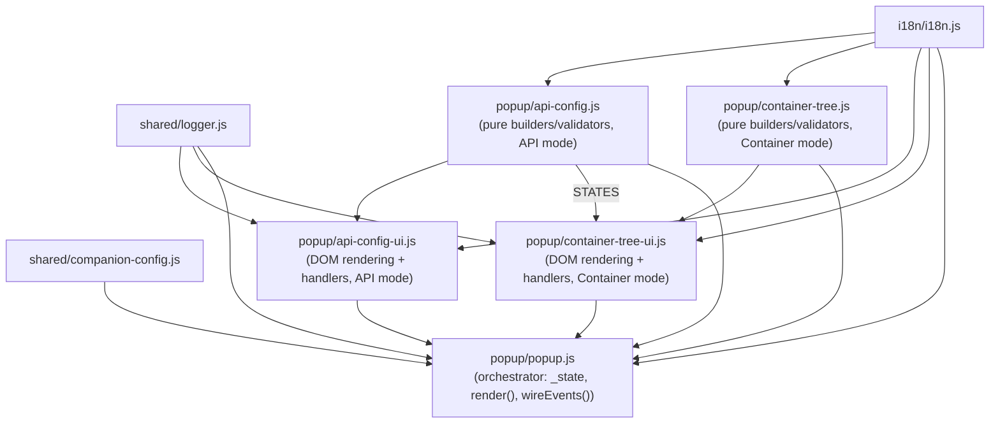
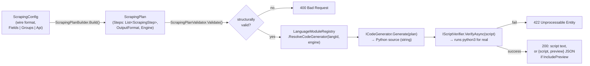
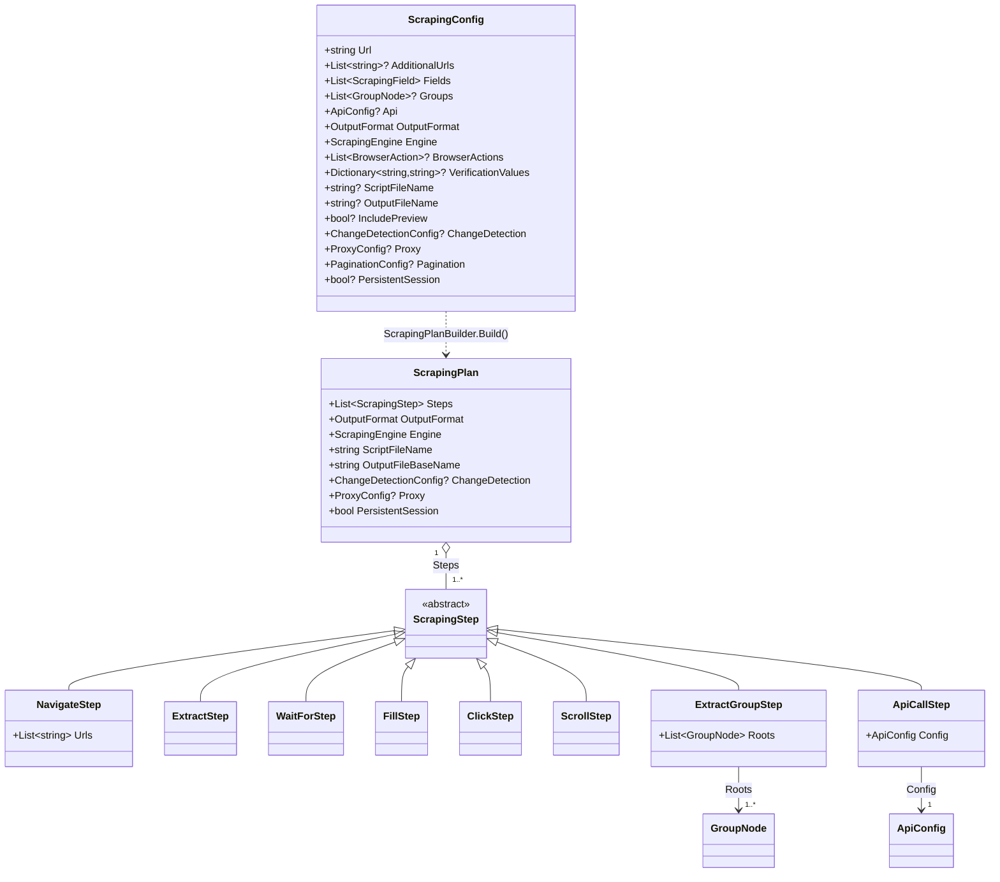
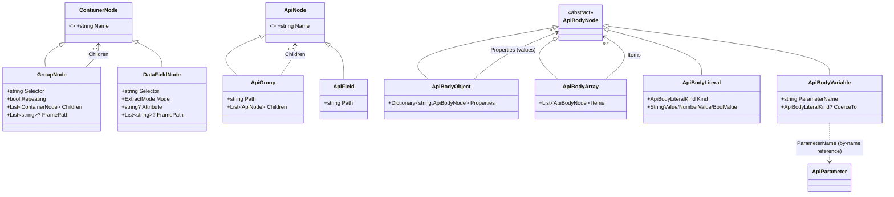
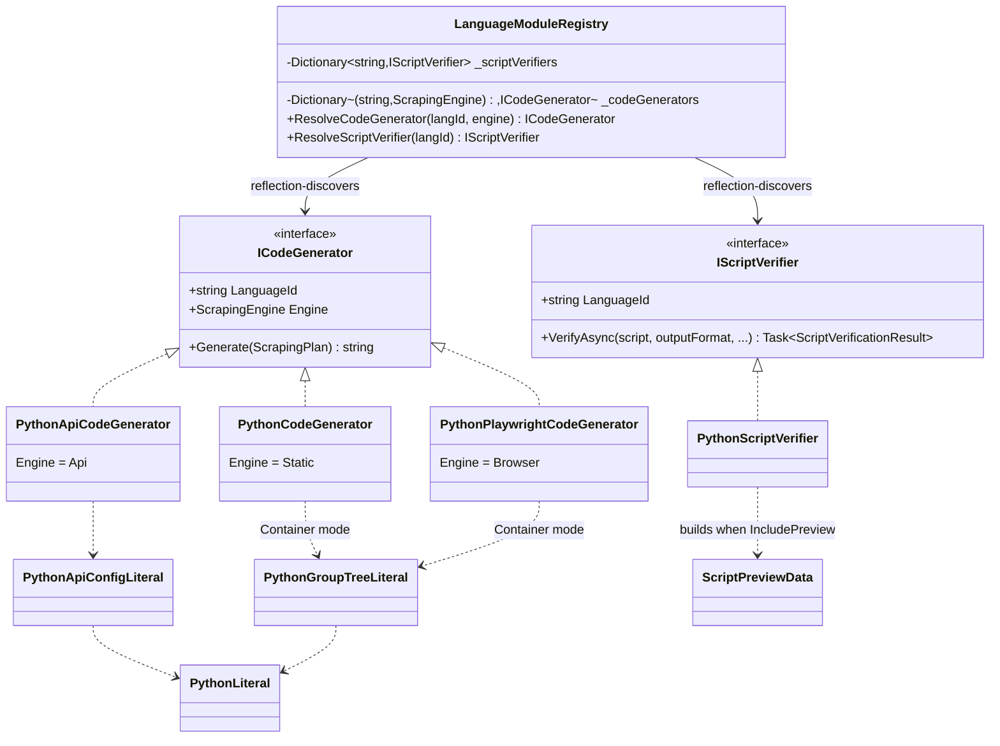
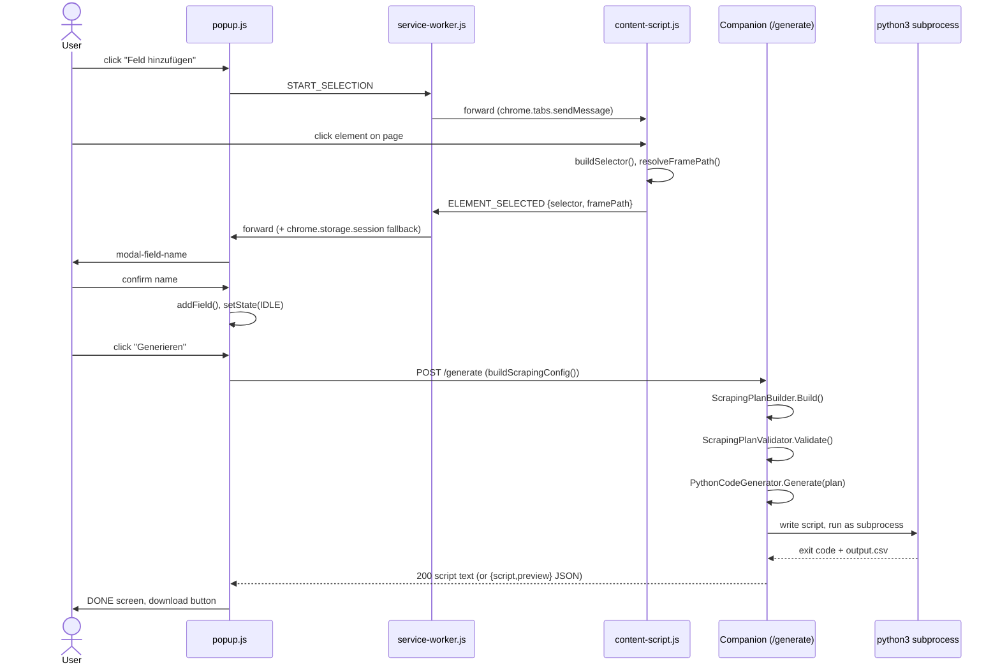

# Scraping Factory — Architecture & Developer Reference

This document is the map of the codebase: how the system is put together, which files
implement which feature, and how the pieces reference each other across the
extension/companion boundary. It's meant to answer three recurring questions:

1. **Reviewing a PR** — does this change fit the existing layering, and did it touch
   every place a change of this shape usually needs to touch?
2. **Planning a new feature** — which layer does it belong in, and what does it
   interact with?
3. **Briefing an implementation** — which exact files should a change start from?

It deliberately does not re-explain *why* individual decisions were made — that's
`CLAUDE.md`, which stays the authoritative source for behavioral detail, edge cases,
and the reasoning behind non-obvious choices. This document is the structural map;
`CLAUDE.md` is the annotated reference. When in doubt, this doc tells you *where*,
`CLAUDE.md` tells you *why it works the way it does*.

Contents:

1. [System Architecture](#1-system-architecture)
2. [Feature Catalog](#2-feature-catalog--implementing-files)
3. [Class & Module Relationship Model](#3-class--module-relationship-model)
4. [Change Recipes](#4-change-recipes--where-a-typical-request-lands)

---

## 1. System Architecture

Scraping Factory has two runtime halves that only ever talk over a local HTTP
connection — there is no shared process, shared memory, or native messaging:

### 1.1 The extension has three separate JS execution contexts

| Context | File(s) | Runs where | Can reach |
|---|---|---|---|
| Content script (isolated world) | `extension/content/content-script.js` | Once per frame of the inspected page (`all_frames: true`) | The page's DOM (but not its JS globals); `chrome.runtime` |
| Network recorder (MAIN world) | `extension/content/api-capture.js` | Once per frame, injected at `document_start`, before the page's own scripts run | The page's real `window.fetch`/`XMLHttpRequest` (needed to patch them); **not** `chrome.runtime` |
| Background service worker | `extension/background/service-worker.js` | Once per browser session | `chrome.tabs`, relays messages; has no page/DOM access itself |
| Side panel UI | `extension/popup/popup.html` + its scripts | Once per open panel | `chrome.runtime`, `chrome.storage`, `fetch` to the companion |

The content script and the MAIN-world recorder are two different JS realms that
happen to share one `window` — they can only talk via `window.postMessage`, never
via a shared variable or direct function call. The service worker cannot talk to a
content script directly either; it must go through `chrome.tabs.sendMessage`, and a
content script/panel replies via `chrome.runtime.sendMessage`. The service worker
(`extension/background/service-worker.js`) is intentionally a pure relay — it holds
no feature logic, just a `FORWARD_TO_TAB` allow-list and a couple of pull-based
request/response bridges (`GET_LOGS`, `GET_API_CAPTURE_ENTRIES`, `CHECK_ROBOTS_TXT`).

### 1.2 The side panel is a single state machine, split across files for size

`extension/popup/popup.js` owns one module-level `_state` object and a `STATES`
enum (`CHECKING_COMPANION → IDLE ⇄ SELECTING`, `IDLE → API_CONFIG`, `IDLE →
GENERATING → DONE`). Every state transition goes through `setState`/`patchState`,
which re-renders the whole visible screen from scratch (`render()`) — there is no
partial/virtual-DOM diffing. `setState` also persists selected state fields to
`chrome.storage.session` (see `persistState()`) so the panel survives being closed
mid-configuration; `chrome.storage.local` is used instead for the two settings that
should survive a full browser restart (UI language, a custom companion URL — see
`extension/i18n/i18n.js` and `extension/shared/companion-config.js`).

Because `popup.js` had grown past ~3800 lines, mode-specific logic was split out
into sibling files loaded *before* it (see `popup.html`'s script order):

Every file uses the same "IIFE assigned to one `self.SFXxx` global, dual-exported
via `module.exports` for Jest" pattern (see any of these files' own top-of-file
comment) — classic `<script>` tags loaded into one document share one global scope,
so this is what keeps `t`, `createLogger`, `STATES`, etc. from colliding across
files. `popup.js` pulls every function it needs off these globals at its own
top-of-file `const { ... } = require(...) : self.SFXxx`.

`api-config-ui.js` and `container-tree-ui.js`'s handler functions take a `bridge`
object (`{ getState, setState, patchState, stopPreviewIfActive, requestDomTree,
showToast }`) as their first parameter instead of closing over `popup.js`'s
`_state` — necessary because `popup.js` loads *after* them, and because each file
is a separate, isolated Jest module with no shared closure. `api-config.js` and
`container-tree.js` need no such bridge: they're pure, DOM-free functions
(build/resolve/insert/remove/serialize tree drafts, no state or DOM access).

### 1.3 The companion pipeline: wire format → canonical IR → codegen → real execution

Everything the extension sends is `ScrapingFactory.Compiler.IR.ScrapingConfig` —
described in full in `CLAUDE.md`'s Architecture Decisions §1. `Program.cs`'s
`/generate` endpoint runs it through a fixed pipeline, and **every** stage after
`ScrapingPlanBuilder` only ever sees the canonical `ScrapingPlan`, never the wire
format directly:

Three things are always true about this pipeline and are worth keeping in mind for
any change:

- **The wire format never gains a new top-level extraction concept without a
  matching new `ScrapingStep` subtype.** `Fields` → `ExtractStep` (many),
  `Groups` → `ExtractGroupStep` (one, wrapping a whole tree), `Api` →
  `ApiCallStep` (one, wrapping `ApiConfig`). All three are mutually exclusive,
  enforced in `Program.cs` before `ScrapingPlanBuilder` ever runs.
- **`ScrapingPlanValidator` runs before any subprocess is spawned.** It only
  catches structural issues that are wrong regardless of runtime behavior
  (bad URL, empty/duplicate names, `FramePath` without `Engine=Browser`, a
  `RangeSource` value that doesn't match its own format). It deliberately never
  validates CSS-selector or JSON-path *syntax/compatibility* — that's an accepted
  limitation (`CLAUDE.md`'s Architecture Decision §3) proven only by real
  execution.
- **Verification is real execution, not a simulation.** `PythonScriptVerifier`
  writes the generated script to a temp directory and runs it via `python3`/
  `python`, then reads back `output.csv`/`output.xml`/`output.json`. This is why a separate
  Playwright-/AngleSharp-based verification path was rejected (`CLAUDE.md`'s
  "Consistency Rule") — only real execution can catch encoding issues, selector
  incompatibilities, and network errors the way the eventual downloaded script
  would hit them too.

### 1.4 The "mode × engine" matrix

Two largely-orthogonal axes run through the whole system:

- **Mode** (what shape the extracted data has): `Fields` (flat) | `Groups`
  (nested tree, forces `OutputFormat.Xml`) | `Api` (forces `Engine.Api`;
  `OutputFormat` then depends on the *response* shape — flat `ItemsPath`/`Fields`
  → `Csv`, tree `Groups` → `Xml`). Any forced default yields to an explicit
  `OutputFormat.Json` request (Issue #86) — Json fits a flat record list just
  as well as `Csv` and a tree just as well as `Xml`.
- **Engine** (how the page is fetched/rendered): `Static` (requests +
  BeautifulSoup) | `Browser` (Playwright + Chromium) | `Api` (plain `requests`,
  forced by API mode regardless of what the wire payload sent). Browser-only
  `BrowserAction`s (`WaitFor`/`Fill`/`Click`/`Scroll`) run before extraction
  **regardless of mode** — a login flow works the same whether the eventual
  extraction is flat, container, or (in principle) API.

Each `(LanguageId, Engine)` pair resolves to exactly one `ICodeGenerator` via
`LanguageModuleRegistry`'s reflection scan; mode is a further branch *inside* each
generator (flat template vs. `_grouped` template), not a separate registry
dimension — see §3.1 for the full class picture.

---

## 2. Feature Catalog — implementing files

For each feature: a plain-language explanation of what it does (for anyone
orienting themselves, not just implementers), followed by the exact file set that
implements it. For behavioral detail (edge cases, validation rules, why a design
choice was made), see the matching section of `CLAUDE.md` — the file lists below
are deliberately terse.

### 2.1 Flat field scraping (original v1 mode)

Click an element on the page → get a CSS selector → name it → repeat → generate a
CSV-producing script.

- Extension: `popup/popup.js` (`_state.fields`, `addField`/`removeField`,
  `renderFields`, `confirmField`), `content/content-script.js` (`buildSelector`,
  `startSelection`/`onClick`)
- Companion: `IR/ScrapingConfig.cs` (`ScrapingField`), `IR/ScrapingStep.cs`
  (`ExtractStep`), `IR/ScrapingPlanBuilder.cs`, `Backends/Python/PythonCodeGenerator.cs`,
  `Backends/Python/PythonPlaywrightCodeGenerator.cs`
- Templates: `language-modules/python/templates/scraper.py.j2`,
  `playwright_scraper.py.j2`

### 2.2 Container mode (nested, repeating groups → XML)

Lets the user model repeating, nested structures on a page — e.g. a list of
product cards, each with its own sub-fields, possibly containing further nested
lists — as a tree of named "container" (group) and "field" nodes, instead of one
flat list of fields. The generated script walks the same tree at runtime and
writes the result as XML instead of CSV, since a tree doesn't fit CSV's flat
column model.

- Extension: `popup/container-tree.js` (pure tree helpers), `popup/container-tree-ui.js`
  (tree editor UI, modals), `popup/popup.js` (`_state.groups`, `_state.mode ===
  'container'`), `content/content-script.js` (`scopeSelector`/`scopeRoot` support
  in `startSelection`/`buildSelector`, `matchGroupTree` for the DOM preview)
- Companion: `IR/ContainerNode.cs` (`GroupNode`/`DataFieldNode`),
  `IR/ContainerNodeJsonConverter.cs`, `IR/ScrapingStep.cs` (`ExtractGroupStep`),
  `IR/ScrapingPlanBuilder.cs`/`ScrapingPlanValidator.cs`,
  `Backends/Python/PythonGroupTreeLiteral.cs`, `PythonCodeGenerator.cs`/
  `PythonPlaywrightCodeGenerator.cs` (their `ExtractGroupStep` branch)
- Templates: `scraper_grouped.py.j2`, `playwright_scraper_grouped.py.j2`

### 2.3 API mode — base (Issue #53: URL params, value sources, headers)

Instead of scraping rendered HTML, records the page's own background JSON API
calls while the user browses, lets them click a value they want and matches it
against the recorded responses to find which request/JSON-path produced it, then
turns the varying parts of that request's URL (query parameters, path segments)
into configurable parameters — each backed by a fixed value, a manually entered
list, a second "discovery" request, or a computed range (e.g. the last N ISO
weeks) — so the generated script can call the API directly, once per parameter
combination, without ever touching the HTML.

- Extension: `popup/api-config.js` (URL decomposition, value-source builders,
  `buildApiConfig`), `popup/api-config-ui.js` (API_CONFIG screen rendering +
  handlers, recording UI), `content/api-capture.js` (MAIN-world fetch/XHR patch),
  `content/content-script.js` (`findApiCandidates`, `deriveItemsAndValuePath`,
  robots.txt-adjacent JSON-path helpers)
- Companion: `IR/ApiConfig.cs` (`ApiConfig`, `ApiParameter`, `ApiParameterSource`
  variants, `ApiHeader`), `IR/ScrapingStep.cs` (`ApiCallStep`),
  `IR/ScrapingPlanBuilder.cs`/`ScrapingPlanValidator.cs`,
  `Backends/Python/PythonApiCodeGenerator.cs`, `PythonApiConfigLiteral.cs`,
  `RangeFormat.cs`, `PythonLiteral.cs`
- Templates: `scraper_api.py.j2`

### 2.4 API mode — nested JSON responses (Issue #54)

Extends API mode (§2.3) to API responses that nest more than one repeating level
— e.g. `categories[*].subcategories[*].products[*]` — by letting the response be
modeled as a tree of groups/fields (each group scoped to a JSON path resolved
relative to its parent) instead of a single flat record list, mirroring Container
mode's own tree editor. Output becomes XML instead of CSV once a tree is used, for
the same reason Container mode's tree output is XML.

- Extension: `popup/api-config.js` (`ApiGroup`/`ApiField` draft
  build/insert/remove/serialize), `popup/api-config-ui.js` (`renderApiTree`,
  `buildApiTreeNodeEl`, sub-group/sub-field search flows), `content/content-script.js`
  (`deriveApiTreeSkeleton`, `resolveApiGroupScopePath`-adjacent `pathStartsWithScope`)
- Companion: `IR/ApiConfig.cs` (`ApiConfig.Groups`, `ApiNode`/`ApiGroup`/`ApiField`),
  `IR/ApiNodeJsonConverter.cs`, `ScrapingPlanValidator.cs` (`ValidateApiNodes`),
  `Backends/Python/PythonApiConfigLiteral.cs` (`RenderGroups`),
  `PythonApiCodeGenerator.cs` (its `api.Groups` branch)
- Templates: `scraper_api_grouped.py.j2`

### 2.5 API mode — POST/GraphQL request bodies (Issue #55)

Extends API mode (§2.3) to POST requests, including GraphQL, by additionally
capturing the outgoing request body and showing it as an editable tree: any value
in that body can be marked "fixed" (kept as recorded) or "variable" (bound to a
new or already-declared parameter, the same parameter mechanism a URL placeholder
already uses). GraphQL needs no special handling of its own — its `query`/
`variables` body is just an ordinary nested object this generic mechanism already
covers.

- Extension: `popup/api-config.js` (`jsonValueToBodyDraft`, body-tree
  update/reference/serialize helpers), `popup/api-config-ui.js`
  (`buildBodyTreeNodeEl`/`renderBodyTree`, body-parameter modal wiring),
  `content/api-capture.js` (`requestBody`/`requestBodySkipped` capture)
- Companion: `IR/ApiBodyNode.cs` (`ApiBodyObject`/`Array`/`Literal`/`Variable`),
  `IR/ApiBodyNodeJsonConverter.cs`, `IR/ApiConfig.cs` (`Method`, `Body`),
  `ScrapingPlanValidator.cs` (`ValidateApiBodyNode`),
  `Backends/Python/PythonApiConfigLiteral.cs` (`RenderBody`)
- Templates: `scraper_api.py.j2` and `scraper_api_grouped.py.j2` (`METHOD`/`BODY`
  constants, `_render_body`/`_coerce_body_value`)

### 2.5a API mode — embedded JSON source (Issue #136)

Extends API mode (§2.3) to sites that render their complete data into the
initial page HTML (Next.js `__NEXT_DATA__`, Nuxt `__NUXT__`, a generic
`<script type="application/json">` state blob) and hydrate the DOM from it
client-side, with no separate, capturable network request ever happening —
`content/api-capture.js`'s recorder has nothing to correlate against in this
case. A second, recording-free candidate source (`findEmbeddedJsonCandidates`)
scans `document.scripts` directly at click time and reuses §2.3's own
`findValueInJson`/`siblingFields`/`deriveApiTreeSkeleton` unchanged — they're
pure functions over already-parsed JSON, agnostic to where it came from. The
companion fetches the page via `requests` and extracts the identified
`<script>` tag via BeautifulSoup instead of parsing a live JSON response body;
`ItemsPath`/`Fields`/`Groups` extraction is otherwise identical to an ordinary
API-mode request (fetch-mechanism-agnostic by design).

- Extension: `content/content-script.js` (`findEmbeddedJsonCandidates`,
  `scriptTagSelector`), `popup/api-config-ui.js`
  (`startEmbeddedJsonFieldSearch`, `confirmEmbeddedJsonFieldCandidate`,
  `renderApiCandidates`'s `candidate.scriptSelector` branch), `popup/api-config.js`
  (`buildApiConfig`'s `embeddedJsonSource` param)
- Companion: `IR/ApiConfig.cs` (`ApiConfig.EmbeddedJsonSource`,
  `EmbeddedJsonSource`), `ScrapingPlanValidator.cs` (`ValidateApiConfig`'s
  `EmbeddedJsonSource` block), `Backends/Python/PythonApiConfigLiteral.cs`
  (`RenderEmbeddedJsonSource`), `PythonApiCodeGenerator.cs`
  (`embedded_json_source`/`embedded_json_source_literal`)
- Templates: `scraper_api.py.j2` and `scraper_api_grouped.py.j2`
  (`EMBEDDED_JSON_SOURCE` constant, `_extract_embedded_json`)

### 2.6 Browser engine, browser actions & login flows (Issues #41/#42/#43)

Adds an optional Playwright-based rendering engine (real Chromium, executes the
page's own JavaScript) as an alternative to the default `requests`-only static
engine, for pages whose content only appears after client-side rendering. On top
of that, a generic, ordered list of "browser actions" — wait for an element, fill
a form field, click, or scroll/click a "load more" button — lets the user
assemble things like a login flow (fill username/password → click submit → wait
for the result) or trigger lazy-loaded content, all executed once before
extraction runs, with no dedicated login-specific UI.

- Extension: `popup/popup.js` (`_state.engine`, `_state.browserActions`,
  `addBrowserAction`/`updateBrowserAction`/`serializeBrowserActions`,
  `renderBrowserActions`, `_state.fillTestValues`/`buildVerificationValues`),
  `content/content-script.js` (cross-frame path resolution: `resolveFramePath`,
  `handleFramePathMessage`, `findIframeSelectorForWindow`, `frameDepth`)
- Companion: `IR/BrowserAction.cs`, `IR/ScrapingStep.cs`
  (`WaitForStep`/`FillStep`/`ClickStep`/`ScrollStep`), `IR/FillVerificationValues.cs`,
  `ScrapingPlanBuilder.cs` (`ToStep`), `ScrapingPlanValidator.cs` (`FramePath`
  validation, browser-only-step gating), `Backends/Python/PythonPlaywrightCodeGenerator.cs`
- Templates: `playwright_navigate_step.py.j2`, `playwright_wait_step.py.j2`,
  `playwright_fill_step.py.j2`, `playwright_click_step.py.j2`,
  `playwright_scroll_step.py.j2`, `playwright_scraper.py.j2`

### 2.7 Trial-run verification (the "Consistency Rule")

Before handing a generated script to the user, the companion actually runs it
once for real — as a subprocess, against the live page/API, in a throwaway
directory — and only returns it if it exits cleanly and produces at least one row
(or XML element). This is what turns "a script that looks plausibly correct" into
"a script proven to work right now, exactly as downloaded" — any failure
(unreachable page, a selector matching nothing, a runtime error) surfaces as a
clear error message instead of a silently broken download.

- Companion: `Backends/Python/PythonScriptVerifier.cs`,
  `Backends/ScriptVerificationResult.cs`, `Backends/IScriptVerifier.cs`,
  `Program.cs` (the `/generate` handler's verify-then-respond logic)

### 2.8 Trial-run data preview (Issue #122)

An opt-in checkbox that lets the user see a capped sample (up to 50 rows/elements)
of what the trial run in §2.7 actually scraped — a table for flat/CSV output, a
read-only pretty-printed XML snippet for tree output — directly in the popup,
before ever downloading or running the script themselves.

- Extension: `popup/popup.js` (`_state.includeDataPreview`, `_state.dataPreview`,
  `renderDataPreview`, the `generate()` branch that parses JSON vs. plain text)
- Companion: `IR/ScrapingConfig.cs` (`IncludePreview`),
  `Backends/ScriptPreviewData.cs`, `Backends/Python/PythonScriptVerifier.cs`
  (`BuildCsvPreview`/`BuildXmlPreview`/`ParseCsvLine`), `Program.cs` (the
  `IncludePreview == true` response branch)

### 2.8a Download the full trial-run output (Issue #161)

A second, independent opt-in checkbox — the complete, uncapped counterpart to
§2.8's capped preview — lets the user download the trial run's actual
`output.csv`/`.xml`/`.json` directly from the `DONE` screen, with no local
Python/Playwright install needed to run the generated script themselves.
`PythonScriptVerifier` reads the raw file text at each of its three success
paths rather than re-deriving it from the already-parsed/capped preview data,
so the download is byte-identical to what the script wrote.

- Extension: `popup/popup.js` (`_state.includeOutputFile`, `_state.outputFile`,
  `triggerOutputFileDownload`, the `btn-download-output` visibility toggle)
- Companion: `IR/ScrapingConfig.cs` (`IncludeOutputFile`),
  `Backends/ScriptVerificationResult.cs` (`OutputFileContent`/`OutputFileName`),
  `Backends/IScriptVerifier.cs`/`Backends/Python/PythonScriptVerifier.cs` (the
  `includeOutputFile` parameter), `Program.cs` (the widened JSON-envelope
  condition, `outputFile` response key)

### 2.9 robots.txt check

A one-click check of whether the currently inspected page is allowed or
disallowed for generic crawlers according to the target site's own robots.txt —
shown directly in the popup so the user can make an informed decision before
scraping a site, without having to go look the file up themselves.

- Extension: `content/content-script.js` (`parseRobotsTxt`, `evaluateRobotsTxt`,
  `checkRobotsTxt`), `background/service-worker.js` (`CHECK_ROBOTS_TXT` relay),
  `popup/popup.js` (`checkRobotsTxt`, the idle-screen result rendering)
- No companion involvement — entirely client-side.

### 2.10 Companion URL configuration/discovery

Lets the extension find, and if needed be manually pointed at, the companion
app's local HTTP server address — needed when the default `localhost:5000` is
already taken on the user's machine, or when the companion runs on a different
port or even a different host than the browser.

- Extension: `shared/companion-config.js` (`getCompanionUrl`,
  `setCompanionUrlOverride`), `popup/popup.js` (`checkCompanion`,
  `useCustomCompanionUrl`, `resetCustomCompanionUrl`, the `COMPANION_ERROR` screen)
- Companion: `ScrapingFactory.Companion/CompanionHostOptions.cs`,
  `CompanionBackendOverrides.cs`, `Program.cs` (`builder.WebHost.UseUrls(...)`)

### 2.11 i18n (extension UI language)

Lets the user pick the popup's own display language (German/English/Spanish)
from a dropdown, independently of the browser's own UI language — via a small
custom dictionary system rather than the browser's built-in `chrome.i18n`, which
is tied to browser language and can't be switched from inside the extension.

- Extension: `i18n/i18n.js`, `i18n/de.json`/`en.json`/`es.json`, every popup
  module's `t(...)` calls, `popup.js`'s `applyStaticTranslations`

### 2.12 Bug reporting / structured logging

Collects the ring-buffered recent activity log kept by all three extension
contexts (content script, service worker, popup) into one downloadable and
shareable report, and can pre-fill a GitHub issue with it — so a bug can be
diagnosed from what actually happened, without having to ask the user to
reproduce it live or describe it from memory.

- Extension: `shared/logger.js` (ring buffer, one instance per JS context),
  `popup/popup.js` (`collectLogs`, `buildBugReport`, `buildGithubIssueUrl`,
  `downloadBugReport`, `reportBug`), `background/service-worker.js`/
  `content/content-script.js` (`GET_LOGS` responders)

### 2.13 DOM tree view & selection-preview highlighting

Two related, optional aids for building a configuration: an expandable tree view
of the page's own DOM shown inside the popup (helps locate an element without
hunting through devtools), and a "preview" toggle that highlights, directly on the
live page, every element the *current* field/group configuration actually matches
right now — so a wrong or too-broad selector is visible immediately, without
running a full trial. Distinct from the *data* preview in §2.8, which shows
scraped values after a real `/generate` trial run, not live DOM matches.

- Extension: `popup/popup.js` (`requestDomTree`, `renderDomTree`,
  `highlightHover`/`highlightSelected`, `startPreview`/`stopPreview`/`togglePreview`),
  `content/content-script.js` (`serializeDomTree`, `computePreviewMatches`,
  `matchFlatFields`/`matchGroupTree`, the preview-overlay drawing functions)

### 2.14 Configuration export ("Konfiguration exportieren")

Downloads the current Fields/Groups/Api configuration as a JSON file — byte-for-
byte the same request body `/generate` would receive, plus a timestamp and
extension version — so a user can attach their exact setup to a bug/selector
report instead of describing it by hand.

- Extension: `popup/popup.js` (`buildConfigExport`, `downloadConfigExport`) — reuses
  `buildScrapingConfig` verbatim, no companion involvement

### 2.14a Local saved-configuration history (Issue #141)

The opt-in counterpart to the export above, for a site scraped repeatedly:
"Speichern" persists the current Fields/Groups/Api configuration into a small
local SQLite database on the companion side (one row per save, scoped by the
saved URL's hostname), and the idle screen's "Gespeicherte Konfigurationen"
panel lists/loads/deletes past saves for whichever site the popup is currently
looking at. "Laden" restores everything `buildScrapingConfig` captures
(fields/groups/apiConfig/engine/browserActions/changeDetection/proxy/
pagination/hardening/persistentSession/output settings) except the `url`
itself — the live browser tab's URL always stays authoritative, so loading an
old config never navigates the popup away from the page it's actually
inspecting. Deleting a saved entry is the one destructive action in this popup
that needs an inline confirm (a second click), since it's the one action that's
persisted outside the current session. Purely local/additive — no data ever
leaves the user's machine, same trust boundary as `/generate` itself; an older
companion without `/configs` (or a network hiccup) just leaves the panel
empty, no error shown.

- Extension: `popup/popup.js` (`fetchSavedConfigs`, `saveCurrentConfig`,
  `loadSavedConfig`, `deleteSavedConfig`, `renderSavedConfigsList`,
  `requestDeleteSavedConfig`/`cancelDeleteSavedConfig`), `popup/
  config-import.js` (`applyConfigToState` — the reverse of
  `buildScrapingConfig`/`buildConfigExport`)
- Companion: `SavedConfigStore.cs` (SQLite-backed, `Host`-scoped lookup —
  the config JSON itself is stored and returned opaquely, never deserialized
  into `ScrapingConfig`), `Program.cs` (`POST /configs`, `GET
  /configs?url=...`, `GET /configs/{id}`, `DELETE /configs/{id}`)

### 2.14b Persist and browse run outputs (Issue #202)

Links Issue #161's own "download the full trial-run output" to Issue #141's
saved-configuration history above: "Output speichern" on the `DONE` screen
saves the current trial run's actual, complete output (the same content
"Download data" already downloads) into a second SQLite table, linked by
foreign key to an already-saved configuration — so a site scraped repeatedly
can accumulate more than one past result to look back at, instead of only
ever having its most recent download. Each row in the "Saved
configurations" panel gains its own expandable "Outputs" sub-panel listing
that config's own saved outputs (download/delete, same inline-confirm-delete
pattern the config row itself uses). Deleting a saved configuration cascades
to its own saved outputs on the database side (`ON DELETE CASCADE`) rather
than needing the extension/companion application layer to clean them up
first. Storage/browse/download only — evaluating hardening checks against a
saved output is a separate, not-yet-implemented issue (#207).

- Extension: `popup/popup.js` (`saveCurrentOutput`, `fetchSavedOutputs`,
  `toggleSavedConfigOutputs`, `downloadSavedOutput`,
  `requestDeleteSavedOutput`/`cancelDeleteSavedOutput`/`deleteSavedOutput`,
  `renderSaveOutputModal`, `openSaveConfigModal`, `downloadFile` — the
  latter two extracted out of Issue #141/#161's own `btn-save-config` click
  handler and `triggerOutputFileDownload` respectively, for reuse from this
  feature's own modal/download action)
- Companion: `SavedConfigStore.cs` (`SavedOutputs` table, `SavedConfigId`
  foreign key with `ON DELETE CASCADE`, `OpenConnection()` enabling `PRAGMA
  foreign_keys` for every query so that cascade actually fires), `Program.cs`
  (`POST/GET /configs/{configId}/outputs`, `GET/DELETE
  /configs/{configId}/outputs/{id}`)

### 2.15 Configurable script/output filenames

Lets the user choose the downloaded script's filename and the name of the data
file the generated script writes (instead of always `scraper.py`/`output.csv`),
with invalid characters stripped the same way on both the extension (for the
actual download) and the companion (baked into the script's own "Run: python
X.py" comment) — so the two names shown to the user always agree.

- Extension: `popup/popup.js` (`sanitizeFileNameBase`, the output-settings inputs,
  `triggerDownload`)
- Companion: `IR/FileNameSanitizer.cs`, `IR/ScrapingConfig.cs`
  (`ScriptFileName`/`OutputFileName`), `IR/ScrapingPlan.cs`
  (`ScriptFileName`/`OutputFileBaseName`), every code generator template's
  `# Run: python X.py` comment and `open(...)`/`tree.write(...)` call

### 2.16 Cross-frame (iframe) selector support (`FramePath`, Issue #42)

Lets a selector target an element that lives inside a (possibly cross-origin)
iframe — e.g. a cookie-consent button or an SSO login widget embedded via an
iframe — by recording the chain of iframe selectors from the top document down to
the frame the click happened in, so the generated Playwright script can reach the
same element later via chained frame locators. Static-engine scripts have no
concept of frames at all, so this only applies to the Browser engine (§2.6).

- Extension: `content/content-script.js` (the whole "Cross-frame path resolution"
  section — `resolveFramePath`, `handleFramePathMessage`, `findIframeSelectorForWindow`),
  `popup/popup.js` (`frameBadgeHtml`, `pendingFramePath` threading through every
  confirm handler)
- Companion: `FramePath` properties on `ScrapingField`/`ExtractStep`/`WaitForStep`/
  `FillStep`/`ClickStep`/`ScrollStep`/`GroupNode`/`DataFieldNode`/every
  `BrowserAction` variant, `ScrapingPlanValidator.ValidateFramePath`, every
  Playwright template's frame-locator chaining

### 2.17 Live selector match-count preview (Issue #85)

Existence/quantity feedback ("N elements found") the instant a selector is
picked, instead of only surfacing much later via a full `/generate` round-trip
and trial run (§2.7). Purely client-side — the content script already has the
live DOM in front of it, so it can just ask it directly.

- Extension: `content/content-script.js` (`countSelectorMatches`, called from
  `onClick` alongside `buildSelector`; result travels as `matchCount` on the
  `ELEMENT_SELECTED` message), `background/service-worker.js`
  (`pendingMatchCount` in the same session-storage fallback as
  `pendingSelector`/`pendingFramePath`), `popup/popup.js`
  (`_state.pendingMatchCount`, `renderMatchCountHint` for the flat/container
  field modals, `showMatchCountToast` for container-group creation, which has
  no confirmation modal of its own to show a hint in)
- No companion involvement — entirely client-side.

### 2.18 Per-field data transformations (Issue #84)

An optional, ordered post-processing chain (trim/regex-extract/find-replace/
to-number) applied to a field's raw extracted value before it's written to the
output row — e.g. turning `"Preis: 12,99 €"` into `"12.99"` without the user
hand-editing the generated script. Added independently to all three field
shapes (flat/container/API) since none of them share a common leaf type.

- Extension: `popup/field-transforms.js` (pure data helpers — create/add/
  remove/update/changeKind/move/validate), `popup/field-transforms-ui.js`
  (DOM rendering + delegated event wiring, shared between `modal-field-name`
  and `modal-field-extended`), `popup/popup.js` (`_state.pendingTransforms`,
  `lastFieldModalSelector` — tells a genuine modal reopen apart from a
  re-render triggered by editing a transform row)
- Companion: `IR/FieldTransform.cs` (`TrimTransform`/`RegexExtractTransform`/
  `ReplaceTransform`/`ToNumberTransform`, polymorphic via an explicit `"kind"`
  tag), `Transforms` on `ScrapingField`/`ExtractStep`/`DataFieldNode`/
  `ApiField`, `Backends/Python/FieldTransformValidator` (regex syntax
  pre-check, mirrors `RangeFormat.ValidateFormat`'s pattern),
  `Backends/Python/PythonFieldTransformLiteral` (the one canonical
  Python-literal serialization, reused by `PythonGroupTreeLiteral`,
  `PythonApiConfigLiteral`, and flat mode's own `TRANSFORMS` dict)
- All six leaf templates (§2.6/§2.3/§2.4's own template list) carry the same
  hand-duplicated `_apply_transforms`/`_to_number` runtime helper pair — see
  the Python Templates section of `CLAUDE.md` for the `_to_number` heuristic's
  documented ambiguity.
- **Live preview** (Issue #143): a hint below the transform list in
  `modal-field-name`/`modal-field-extended` shows what the chain actually
  produces against the picked element's real raw value, updating live as
  steps are added/edited/reordered/removed — entirely client-side, no
  `/generate` round trip. `content-script.js`'s `onClick` collects the
  clicked element's trimmed text and full attribute map
  (`collectElementAttributes`), sent as `rawText`/`attributes` on the same
  `ELEMENT_SELECTED` message the selector/matchCount already travel on;
  `service-worker.js`'s session-storage fallback persists them as
  `pendingRawText`/`pendingElementAttributes` alongside `pendingMatchCount`.
  `field-transforms.js`'s `applyTransformsPreview`/`toNumberPreview` are a
  hand-kept JS mirror of the Python runtime's own
  `_apply_transforms`/`_to_number` — an invalid-for-JS regex pattern makes
  the preview return `null` (rendered as "preview unavailable") instead of
  throwing.
- **API mode follow-up:** the same editor is also reachable from the
  `API_CONFIG` tree screen (§2.16), via a "Transformieren" button rendered
  next to every leaf `ApiField` row in `popup/api-config-ui.js`'s
  `buildApiTreeNodeEl` (never for a group node — only a leaf actually
  extracts a value, matching `ApiGroup` having no `Transforms` property on
  the companion side). Opens `modal-api-field-transforms`, reusing the exact
  same `field-transforms.js`/`field-transforms-ui.js` editor and
  `_state.pendingTransforms` slot the flat/container modals already use
  (mutually exclusive screens, no conflict); confirming writes the chain
  onto the `ApiField` draft node via `updateApiTreeNode`, and
  `serializeApiTree` omits the key on the wire when the chain is empty
  (mirroring `serializeGroupTree`'s own convention).
- **API mode live preview** (Issue #147): unlike a DOM pick, a tree field
  node has no raw value to preview against once inserted — the only value
  ever available is the one matched at candidate-confirm time.
  `buildApiFieldDraft` (`api-config.js`) gained an optional `sampleValue`
  (the raw JSON scalar the field/sibling resolved to — `candidate.value` for
  the primary field, or the matching entry's own `.value` in
  `candidate.siblings` for a picked sibling, see `content-script.js`'s
  `siblingFields`) — popup-internal only, never sent to the companion.
  `openApiFieldTransformsModal` converts it into `pendingRawText` the same
  way the Python runtime resolves a value before applying transforms (`""`
  for a real JSON `null`, `undefined`/no-sample maps to `null` so the
  preview stays hidden) and reuses the exact same `renderTransformPreview`
  call flat mode's own modal already makes.

### 2.18a Safe type-conversion transforms (Issue #205)

Three more `FieldTransform` kinds — `ToIntegerTransform`/`ToBooleanTransform`/
`ToDateTransform` — alongside §2.18's original four, added for the same
"guarantee a mapped value is actually a well-formed type" need Output
Blueprints' design surfaced but deliberately left for the transform pipeline
to solve rather than inventing a second, Blueprint-local type system. Unlike
`ToNumberTransform`'s best-effort heuristic coercion, all three are strict —
a value that isn't already well-formed for the target type is a conversion
failure, not an approximation — and share one `OnError`/`DefaultValue`
contract (`TransformErrorMode.KeepOriginal`/`UseDefault`) instead of the
"fail the row" option floated in the issue itself (judged not worth the
row/element-dropping machinery `RequiredFieldsCheck` only built at real cost
for a hardening check that runs once at the very end, not per-transform).

- IR: `IR/FieldTransform.cs` (`ToIntegerTransform`/`ToBooleanTransform`/
  `ToDateTransform`, `enum TransformErrorMode`). `ToDateTransform.SourceFormat`
  reuses `RangeSource.Format`'s own `"{yyyy}"`/`"{mm}"`/`"{dd}"` mini-template
  (`Backends/Python/RangeFormat`) rather than inventing a second syntax —
  `FieldTransformValidator` delegates straight to
  `RangeFormat.ValidateFormat(RangeType.Date, ...)`, and
  `PythonFieldTransformLiteral` resolves an unset format via
  `RangeFormat.Resolve(RangeType.Date, ...)`.
- `Backends/Python/FieldTransformValidator` (same single call site every
  field shape — including the "blocks" feature's own extraction blocks —
  already shares): rejects `OnError == UseDefault` with no `DefaultValue`
  set, and an invalid `SourceFormat`.
- `Backends/Python/PythonFieldTransformLiteral`: `OnError` renders via
  `.ToString()` (`"KeepOriginal"`/`"UseDefault"`), the same PascalCase
  convention `HardeningCheck.Severity` already uses in
  `PythonHardeningLiteral`, so both sides compare the same vocabulary.
- Every template that already carries `_apply_transforms`/`_to_number` (the
  six from §2.6/§2.3/§2.4 plus two more added since by an unrelated feature)
  gains `_to_integer`/`_to_boolean`/`_to_date` runtime helpers and their own
  `_apply_transforms` branches, following the same hand-duplicated-per-
  template convention `_to_number` already established.
  `_to_date` compiles `SourceFormat` the same escape-then-substitute way
  `RangeFormat.CompilePattern` does in C#, and rejects a structurally-
  matching but non-existent calendar date (e.g. `"2026-02-30"`) via
  `datetime.date`'s own `ValueError`.
- Extension: the shared `field-transforms.js`/`field-transforms-ui.js`
  editor (§2.18) gains the three kinds directly — no new module, since every
  mode's transform modal already routes through this one editor.
  `toIntegerPreview`/`toBooleanPreview`/`toDatePreview` are hand-kept JS
  mirrors of the three new Python helpers, feeding the existing live preview
  (Issue #143) the same way `toNumberPreview` already does.
- Tests: `FieldTransformJsonTests` (polymorphic (de)serialization),
  `ScrapingPlanValidatorTests` (`OnError`/`SourceFormat` validation),
  `TypeConversionTransformEndToEndTests` (real generated-script runs proving
  each kind's success/failure/onError behavior — the same "black-box
  `PythonScriptVerifier` can't see per-cell values" reasoning
  `HardeningNullRateEndToEndTests` already documents).

### 2.19 Multiple start URLs (Issue #83)

Lets the same Fields/Groups extraction config run against a static,
user-supplied list of start URLs in one script run, instead of exactly one —
results from every URL are combined into a single output file. Applies to
flat and container mode only; API mode already builds its own request URL
from `urlTemplate`/`Parameters` and rejects the combination outright.

- Extension: `popup/popup.js` (`_state.additionalStartUrls`,
  `parseAdditionalUrls` — splits the textarea on newlines and drops blank
  lines, threaded through `buildScrapingConfig`/`buildConfigExport` as
  `additionalUrls`), `popup/popup.html` (`#input-additional-urls`, hidden for
  API mode via the same `_state.mode === 'api'` toggle `#preview-section`
  already uses)
- Companion: `IR/ScrapingConfig.cs` (`AdditionalUrls`, additive/wire-
  compatible), `IR/ScrapingPlanBuilder.cs` (combines `Url` + trimmed,
  non-blank `AdditionalUrls` entries into `NavigateStep.Urls`),
  `IR/ScrapingStep.cs` (`NavigateStep.Urls`, `List<string>` instead of a
  single `Url` — the one breaking change to the canonical `ScrapingPlan`,
  confined to the two code generators below), `IR/ScrapingPlanValidator.cs`
  (validates every entry, identifying a failure by index), `Program.cs` (the
  `Api`+`AdditionalUrls` `400` guard, same style as the existing Fields/
  Groups/Api mutual-exclusivity checks)
- `Backends/Python/PythonCodeGenerator.cs`/`PythonPlaywrightCodeGenerator.cs`
  read `NavigateStep.Urls` (a list) instead of `.Url`, rendered into each
  template as `URLS` instead of `URL`. `scraper.py.j2`/
  `playwright_scraper.py.j2` loop `main()` over `URLS`, combining every
  URL's rows into one `data` list; `scraper_grouped.py.j2`/
  `playwright_scraper_grouped.py.j2` combine every URL's own `scrape(url)`
  children into one `<Ergebnis>` root, reusing the same sibling-merging
  pattern already used for multiple root groups from a single URL.
  `scraper_api.py.j2`/`scraper_api_grouped.py.j2` (§2.3/§2.4) are untouched.
- Fixes a latent bug surfaced by this change: `playwright_navigate_step.py.j2`
  used to bake the target URL in as a literal, ignoring `scrape(url)`'s own
  parameter — it now emits `page.goto(url, ...)`, which is what makes
  per-URL looping possible for the Browser engine at all.

### 2.19a Pagination (Issue #174)

Classic multi-page pagination (page 1, 2, 3, … via a "next" link or a
page-number URL template) — distinct from infinite-scroll/"load more" on a
single page, already covered by the Scroll browser action (§2.6). Applies to
flat and container mode, both engines; not applicable to API mode, which
already has its own page-parameter mechanism via a Number `RangeSource`
(§2.3). Composes with §2.19's own Multiple start URLs: each start URL
paginates onward independently, entirely inside the generated script's own
`scrape()` function, so `main()`'s existing multi-URL loop needs no changes.

- Extension: `popup/popup.js` (`_state.pagination`, `buildPaginationConfig`
  — mirrors `buildProxyConfig`'s own "incomplete draft = toggle-off"
  convention — threaded through `buildScrapingConfig`/`buildConfigExport`),
  `popup/popup.html` (`#pagination-config` inside the collapsible Settings
  section, hidden for API mode via `#pagination-toggle-row`)
- Companion: `IR/PaginationConfig.cs` (`NextLinkPagination`/
  `PageNumberPagination`, `[JsonPolymorphic]` "kind" tag, both with a
  `MaxPages` safety cap), `IR/ScrapingConfig.cs`/`IR/ScrapingPlan.cs`
  (`Pagination`, mode-independent, carried through unchanged by
  `IR/ScrapingPlanBuilder.cs` for the Fields/Groups branches only),
  `IR/ScrapingPlanValidator.cs` (`MaxPages > 0`, a non-blank
  `NextLinkSelector`, or — reusing the same `UrlTemplatePlaceholderPattern`
  API mode's own `UrlTemplate` validation already uses — that
  `PageNumberPagination.UrlTemplate` references both `{url}` and `{page}`),
  `Program.cs` (the `Api`+`Pagination` `400` guard, same style as
  `Api`+`AdditionalUrls`)
- `Backends/Python/PythonPaginationLiteral.cs` (`BuildContext`, mirrors
  `PythonProxyLiteral`/`PythonChangeDetectionLiteral` exactly — always emits
  every field regardless of kind), wired into all four non-API codegen call
  sites in `PythonCodeGenerator.cs`/`PythonPlaywrightCodeGenerator.cs`
- Templates: `scraper.py.j2`, `playwright_scraper.py.j2`,
  `scraper_grouped.py.j2`, `playwright_scraper_grouped.py.j2` — `scrape(url)`
  restructured into a loop (page 1 unchanged; further pages via
  `NEXT_LINK_SELECTOR`'s `href` or `PAGINATION_URL_TEMPLATE.format(url=url,
  page=page_number)`, stopping on an empty page, `PAGINATION_MAX_PAGES`, or a
  vanished next-link selector). The two Playwright templates reuse the same
  browser/page session across paginated pages (`page.goto` for page 2+)
  rather than relaunching; the full action sequence (login flow etc.) still
  runs only once, for page 1.

### 2.20 Change detection + notification (Issue #87)

Lets the generated script compare each run's output against the previous
run's and notify (email or webhook) only when something actually changed —
mode-independent (Fields/Groups/Api alike). No companion-side diffing logic
at all; the companion only validates the config and renders the right
literals, the actual diff/notify happens entirely at runtime inside the
generated script.

- Extension: `popup/popup.js` (`_state.changeDetection`,
  `buildChangeDetectionConfig` — converts the editable draft into the wire
  shape, returning `null` when disabled or a *required* env-var-name field
  is still blank, threaded through `buildScrapingConfig`/`buildConfigExport`
  as `changeDetection`), `popup/popup.html` (`#toggle-change-detection`,
  Email/Webhook method buttons, one text input per env-var name — every
  field is a name the user types, mirroring `FillAction`'s own
  `environmentVariableName` input, never a fixed/conventional name)
- Companion: `IR/ChangeDetectionConfig.cs` (`ChangeDetectionConfig`/
  `EmailNotificationConfig`/`WebhookNotificationConfig`, additive/wire-
  compatible), `IR/ScrapingPlan.cs` (`ChangeDetection`, carried through
  unchanged by `IR/ScrapingPlanBuilder.cs` in all three shape branches — no
  forcing/translation needed), `IR/ScrapingPlanValidator.cs` (notify method,
  matching sub-config present, every env-var name valid),
  `Backends/Python/PythonChangeDetectionLiteral.cs` (`BuildContext` — the
  one `change_detection.*` Scriban context object every one of the six
  templates renders from, always emitting all seven possible fields
  regardless of which method is active)
- All six templates gain an `OUTPUT_PATH` constant and, when enabled, a
  `_read_previous_output`/`_notify_email`/`_notify_webhook`/`_notify_change`
  helper set wrapped around the existing write logic: read the previous
  output before writing the new one, write as always, then diff the two via
  `difflib.unified_diff` — a notification fires only on an actual
  difference, never on the first run (no previous file yet = baseline
  only), which also means this path never executes during `/generate`'s
  trial-run verification (always a fresh temp directory). Email uses
  `smtplib` with opportunistic STARTTLS (`server.has_extn("starttls")`);
  webhook uses `urllib.request` — both stdlib-only. A notification failure
  is caught and printed as a warning, never re-raised, since the current
  run's own output was already written successfully by that point.
- Tests: `ChangeDetectionEndToEndTests.cs` runs the real generated script as
  a raw subprocess twice in one shared, test-controlled directory (unlike
  `PythonScriptVerifierTests`, which always uses a fresh temp directory per
  call — the reason this couldn't just be a `PythonScriptVerifier` test),
  proving a genuine cross-run diff actually triggers delivery for both
  methods (webhook via the existing `LocalTestServer`, email via a new
  `LocalSmtpTestServer` — a minimal fake SMTP server that never advertises
  STARTTLS, exercising the generated script's own "upgrade only if offered"
  logic for real).

### 2.21 Proxy support (Issue #88)

Lets the generated script route its outbound requests through proxies the
user already has access to, instead of connecting directly — mode-
independent (Fields/Groups/Api alike). The extension/companion never see a
literal proxy address, only the name of an environment variable holding a
comma-separated list; the generated script resolves and rotates through it
entirely at runtime, mirroring how `ChangeDetectionConfig` (Issue #87)
already keeps credentials env-var-name-only.

- Extension: `popup/popup.js` (`_state.proxy`, `buildProxyConfig` —
  converts the editable draft into the wire shape, returning `null` when
  disabled or the env-var-name field is still blank, threaded through
  `buildScrapingConfig`/`buildConfigExport` as `proxy`), `popup/popup.html`
  (`#toggle-proxy`, one text input for the env-var name, right below the
  change-detection block, same `environmentVariableName`-only pattern as
  `FillAction`)
- Companion: `IR/ProxyConfig.cs` (`ProxyConfig`, a single required
  `EnvironmentVariableName`, additive/wire-compatible), `IR/ScrapingPlan.cs`
  (`Proxy`, carried through unchanged by `IR/ScrapingPlanBuilder.cs` in all
  three shape branches), `IR/ScrapingPlanValidator.cs` (env-var name valid),
  `Backends/Python/PythonProxyLiteral.cs` (`BuildContext` — the one
  `proxy.*` Scriban context object every one of the six templates renders
  from, mirroring `PythonChangeDetectionLiteral`). All three code
  generators extend their `needs_os_import`/`NeedsOsImport` checks with a
  configured `Proxy`, since the generated script reads the proxy list via
  `os.environ.get(...)` too. `Backends/Python/PythonScriptVerifier.cs`
  treats a generated script's dedicated `EXIT_MISSING_ENV_VAR` (78) exit
  code as compatible with success (falls through to the normal "did it
  produce data" check instead of failing immediately like any other
  nonzero code); only combined with no output file at all (the `FillStep`
  case, see below) does it short-circuit with the script's own clean
  stderr message.
- All six templates gain, when enabled, a `PROXY_ENV_VAR` constant plus a
  duplicated `_next_proxy()` helper (the env var's comma-separated value
  parsed into a list, cycled round-robin via `itertools.cycle`). The
  static/API engines (`requests`) wire a `_proxies_for_requests()` helper
  (`{"http": p, "https": p}`) into every `requests.get`/`requests.post`
  call site, including the API templates' discovery-source request; the
  browser engine (Playwright) instead parses the picked URL via
  `urllib.parse.urlsplit` into Playwright's `{"server", "username",
  "password"}` proxy shape (`_next_playwright_proxy()`) and passes it to
  `p.chromium.launch(proxy=...)`. A missing env var no longer raises a raw
  `KeyError` — it's read via `os.environ.get(...)`, prints a German warning
  to stderr, and is treated the same as an empty/blank value ("no proxies
  configured", direct connection); the run is still flagged via a shared
  `EXIT_MISSING_ENV_VAR = 78` sentinel once `main()` otherwise completes
  successfully (also used by `FillStep`'s `_require_env` helper in the two
  Playwright templates, replacing its own former raw `os.environ[...]`
  read — a missing credential there is still a hard stop, just with a
  clean message instead of an unhandled traceback).
- Tests: `ProxyEndToEndTests.cs` runs the real generated static-engine
  script as a subprocess against a new `LocalHttpProxyTestServer` — a
  minimal raw-socket fake forward proxy (mirroring `LocalSmtpTestServer`'s
  style) that records every request line it receives and answers with its
  own canned body, proving both that a request actually routes through the
  configured proxy (the real target's content never reaches the output) and
  that round-robin rotation picks a different proxy per request across
  multiple start URLs.

### 2.22 Persistent session/cookie handling (Issue #175)

Browser-engine only (rejected server-side for Static/Api, same as
WaitFor/Fill/Click/Scroll steps) — lets the generated script save its
Playwright browser context's `storage_state` (cookies/localStorage) to a
sidecar file next to its own output after every run, and, once that file
exists from a previous run, skip the configured login-flow browser actions
(WaitFor/Fill/Click/Scroll) entirely on the next run — Navigate always still
runs. Avoids repeating a login flow on every scheduled/recurring run of the
same script.

- Extension: `popup/popup.js` (`_state.persistentSession`, a plain boolean —
  unlike Proxy/Pagination, there are no sub-fields to draft — threaded
  through `buildScrapingConfig`/`buildConfigExport` as `persistentSession`,
  only sent when `true`), `popup/popup.html`
  (`#persistent-session-toggle-row` inside `#browser-actions-section`,
  visible only for Engine=Browser, placed alongside the login actions it
  reuses rather than in the general "Settings" section)
- Companion: `IR/ScrapingConfig.cs`/`IR/ScrapingPlan.cs`
  (`PersistentSession`, carried through unchanged by
  `IR/ScrapingPlanBuilder.cs` in all three shape branches),
  `IR/ScrapingPlanValidator.cs` (`PersistentSession` requires Engine
  `Browser`, same placement/style as the `browserOnlySteps` gate)
- `Backends/Python/PythonPlaywrightCodeGenerator.cs` splits the rendered
  action sequence into an always-run `navigate_action` fragment and a
  separately re-indented `login_actions` fragment (WaitFor/Fill/Click/
  Scroll) — needed only when `PersistentSession` is enabled, to nest the
  latter inside the generated `if not _session_exists:` guard; `actions`
  itself (used when disabled) is computed exactly as before, so a disabled
  config's output stays byte-for-byte unchanged. Static-engine codegen
  (`PythonCodeGenerator.cs`) and API mode are untouched — this is
  Browser-engine-only end to end.
- Templates: `playwright_scraper.py.j2`, `playwright_scraper_grouped.py.j2`
  (the only two Browser-engine shell templates) gain a
  `SESSION_STATE_PATH = OUTPUT_PATH + ".session-state.json"` constant (with
  a code comment warning it contains live session cookies) and, in
  `scrape(url)`: `browser.new_context(storage_state=SESSION_STATE_PATH if
  _session_exists else None)` + `context.new_page()` in place of
  `browser.new_page()`, the login-only actions wrapped in `if not
  _session_exists:`, and `context.storage_state(path=SESSION_STATE_PATH)`
  saved right before `browser.close()`. `/generate`'s own trial run needs no
  special handling: it always runs in a fresh temp directory with no
  pre-existing session file, so it naturally always takes the "first run, do
  the full login" path.
- Tests: `PersistentSessionEndToEndTests.cs` runs the real generated script
  as a subprocess twice against a shared work directory (mirrors
  `HardeningBaselineEndToEndTests`' "real two-run" pattern) — a
  `LocalTestServer` serves a login form until a session cookie is present,
  then protected content; the second run deliberately omits the login
  credential env vars, so a broken skip-login guard would fail fast via
  `EXIT_MISSING_ENV_VAR` (78) instead of succeeding.

### 2.23 Output Blueprints: reusable output field-name/order mapping (Issue #191)

A small, persisted, site-independent "blueprint" — just a name plus an
ordered list of target field names — lets a recurring scrape (of the same or
different configurations) always write the same fixed column set/order/
naming, e.g. for a downstream import pipeline that expects a stable schema.
Reachable only for flat-shaped output (flat mode, or API mode's own flat
`ItemsPath`/`Fields` shape); rejected outright (not silently ignored) for
container mode, API's tree shape, Combined mode, and Blocks mode.

- Extension: `popup/output-blueprints.js` (pure — editing a blueprint's own
  ordered field-name list in the create/edit modal;
  building/validating the per-scrape source-field mapping draft) and
  `popup/output-blueprints-ui.js` (CRUD against `/blueprints`, the
  management modal, the create/edit modal, and the mapping picker itself —
  one `<select>` row per target field, sourced via the same
  `collectFieldNames` the hardening null-rate/required-fields pickers
  already use). `popup/popup.js` (`_state.selectedOutputBlueprintId`/
  `selectedOutputBlueprintFieldNames`/`outputBlueprintMapping`, persisted
  like Proxy/Hardening), `popup/idle-screen-ui.js`
  (`#output-blueprint-toggle-row`'s mode-gated visibility,
  `OUTPUT_BLUEPRINT_RESET` on any mode switch, blocking "Generate" while a
  picked mapping is incomplete). `scraping-config-builder.js`
  (`buildOutputBlueprintMapping` → `outputBlueprint`, omitted whenever no
  blueprint is picked or the mapping isn't complete, the same convention
  `buildProxyConfig`/`buildChangeDetectionConfig` already use),
  `config-import.js` (`applyOutputBlueprintConfig`, the reverse).
- Companion: `OutputBlueprintStore.cs` (own SQLite file/db, no FK/cascade —
  a blueprint isn't tied to any saved configuration), five endpoints under
  `/blueprints` (list/get/create/update/delete) registered in `Program.cs`,
  which also rejects `OutputBlueprint` combined with `Groups`/`Api.Groups`/
  `Combined`/`Blocks` with a `400`.
- Compiler: `IR/OutputBlueprintMapping.cs` (`OutputBlueprintMapping` —
  `BlueprintId` kept only for the extension's own round-tripping, plus a
  `List<OutputBlueprintFieldMapping>` of `TargetField`/`SourceField` pairs),
  added to `ScrapingConfig`/`ScrapingPlan` and carried through by
  `IR/ScrapingPlanBuilder.cs` only in the flat-`Fields`/Api-flat branches.
  `IR/ScrapingPlanValidator.cs`'s `ValidateOutputBlueprint` checks
  non-empty/non-duplicate target and source names and that every
  `SourceField` references a real available field.
  `Backends/Python/PythonOutputBlueprintLiteral.cs` renders it into a
  `[{"target": ..., "source": ...}, ...]` literal, mirroring
  `PythonFieldTransformLiteral`.
- Templates: `scraper.py.j2`, `playwright_scraper.py.j2`, `scraper_api.py.j2`
  (the three flat-shape shells only) gain a `BLUEPRINT_MAPPING` constant
  that, when non-empty, takes over building `output_rows`/the CSV fieldnames
  at write time (rename, reorder, drop unmapped source fields) — taking
  precedence over Issue #178's `FIELD_OUTPUT_NAMES` at that same step.
  `data` itself stays untouched, so hardening/change-detection keep
  operating on the original field names either way.
- Tests: `OutputBlueprintStoreTests.cs`, `OutputBlueprintsEndpointTests.cs`,
  `OutputBlueprintMappingJsonTests.cs` (wire round-trip),
  `OutputBlueprintEndToEndTests.cs` (real generated-script output actually
  has the blueprint's own column names/order); Jest
  `output-blueprints.test.js` (pure helpers) and
  `output-blueprints-ui.test.js` (DOM/wiring via `require('./popup')`).

---

## 3. Class & Module Relationship Model

### 3.1 Companion IR — config, plan, and steps

`ScrapingPlanBuilder.Build()` is the *only* place a `ScrapingConfig` is turned into
a `ScrapingPlan` — every backend (`ICodeGenerator`), the validator, and the
verifier only ever operate on the `Steps` list, never on `Fields`/`Groups`/`Api`
directly. Reading a new step type into existence always means: add the subtype to
`ScrapingStep.cs`, extend `ScrapingPlanBuilder.Build()`'s translation, and extend
`ScrapingPlanValidator.Validate()`'s structural checks — see §4 for the full recipe.

### 3.2 The three "node tree" shapes, compared

These three trees look almost identical in structure (a discriminated union of a
branch and a leaf, JSON-converted without an explicit tag where the branch/leaf
split is structurally obvious) but exist for three different modes and are **not**
polymorphic with each other — don't confuse `ContainerNode` (CSS-selector-based,
Container mode) with `ApiNode` (JSON-path-based, API mode's response tree) or
`ApiBodyNode` (API mode's *request* tree, a 4-way split instead of 2-way).

| | Discriminator on the wire | Converter | Structural tell? |
|---|---|---|---|
| `ContainerNode` (Group vs. Field) | none (structural) | `ContainerNodeJsonConverter` | presence of `"children"` |
| `ApiNode` (Group vs. Field) | none (structural) | `ApiNodeJsonConverter` | presence of `"children"` |
| `ApiBodyNode` (4-way) | none (structural) | `ApiBodyNodeJsonConverter` | `"properties"` / `"items"` / `"parameterName"` / else literal |
| `ApiParameterSource` (3-way: static/discovery/range) | explicit `"kind"` | `[JsonPolymorphic]` (built-in) | none — no structural tell between the three |
| `BrowserAction` (4-way: waitFor/fill/click/scroll) | explicit `"kind"` | `[JsonPolymorphic]` (built-in) | none |
| `ApiBodyLiteral.Kind` (inside the 4-way split above) | explicit `"kind"` field | (part of `ApiBodyNodeJsonConverter`) | none — can't tell "no value" from a literal `null` |

The rule of thumb (see `CLAUDE.md`'s Architecture Decisions §7): a discriminated
union needs an explicit tag only when its variants have no structural
difference a converter could sniff. A branch-vs-leaf split (has children or not)
never needs one; three parallel "flavors" of the same kind of node (three parameter
sources, four action kinds) always do.

### 3.3 Backends: registry, generators, verifier

`LanguageModuleRegistry` discovers every `ICodeGenerator`/`IScriptVerifier` by
reflecting over the assembly at startup (any concrete class implementing the
interface, with a constructor callable with zero args) — **a new backend needs no
registration anywhere**, just the class itself plus a distinct `(LanguageId,
Engine)` pair. `CompanionBackendOverrides.Build()` maps `appsettings.json`'s
`Companion:PythonExecutable`/`Companion:VerifierTimeoutSeconds` onto whatever
optional constructor parameters a discovered type happens to expose, by name — the
registry itself has no compile-time knowledge of `PythonScriptVerifier`'s
constructor shape.

### 3.4 Extension ↔ Companion — the wire-format equivalence table

This is the cross-boundary "ORM": for a given concept, the extension-side
JS builder/draft shape on the left must always produce exactly the JSON shape the
companion's C# type on the right (de)serializes. A change to either side that
isn't mirrored on the other is a live bug that only ever surfaces once a real
`/generate` request round-trips through — the wire format is not itself checked at
compile time anywhere.

| Concept | Extension builder / draft shape | Wire JSON | Companion type |
|---|---|---|---|
| Flat field | `popup.js`: `addField()`, `buildScrapingConfig()`'s `fields.map(...)` | `{name, selector, attribute?, framePath?}` | `IR/ScrapingConfig.cs`: `ScrapingField` |
| Container tree node | `container-tree.js`: `buildGroupNode`/`buildFieldNode`, `serializeGroupTree` | `{name,selector,repeating,children:[...],framePath?}` or `{name,selector,mode,attribute?,framePath?}` | `IR/ContainerNode.cs`: `GroupNode`/`DataFieldNode` (via `ContainerNodeJsonConverter`) |
| API config (top level) | `api-config.js`: `buildApiConfig()` | `{urlTemplate, method?, parameters:[...], headers?, itemsPath+fields \| groups, body?, embeddedJsonSource?}` | `IR/ApiConfig.cs`: `ApiConfig` |
| API parameter source | `api-config.js`: `buildStaticListSource`/`buildDiscoverySource`/`buildRangeSource` | `{kind:"staticList"\|"discovery"\|"range", ...}` | `IR/ApiConfig.cs`: `ApiParameterSource` (`[JsonPolymorphic]`) |
| API embedded JSON source (Issue #136) | `api-config-ui.js`: `confirmEmbeddedJsonFieldCandidate()` (`{scriptSelector}`, stamped from `content-script.js`'s `scriptTagSelector`) | `{scriptSelector}` | `IR/ApiConfig.cs`: `EmbeddedJsonSource` (plain optional object, no converter) |
| API response tree node | `api-config.js`: `buildApiGroupDraft`/`buildApiFieldDraft`, `serializeApiTree` | `{name,path,children:[...]}` or `{name,path}` | `IR/ApiConfig.cs`: `ApiGroup`/`ApiField` (via `ApiNodeJsonConverter`) |
| API request body node | `api-config.js`: `jsonValueToBodyDraft`/`serializeBodyTree` | `{properties:{...}}` / `{items:[...]}` / `{kind,stringValue\|numberValue\|boolValue}` / `{parameterName, coerceTo?}` | `IR/ApiBodyNode.cs`: `ApiBodyObject`/`Array`/`Literal`/`Variable` (via `ApiBodyNodeJsonConverter`) |
| Browser action | `popup.js`: `addBrowserAction`/`serializeBrowserActions` | `{kind:"waitFor"\|"fill"\|"click"\|"scroll", selector, ...}` | `IR/BrowserAction.cs`: `WaitForAction`/`FillAction`/`ClickAction`/`ScrollAction` (`[JsonPolymorphic]`) |
| Verification values (login test values) | `popup.js`: `buildVerificationValues()` (from `_state.fillTestValues`, never persisted) | `{verificationValues: {ENV_NAME: "value"}}` | `IR/FillVerificationValues.cs`: `Filter()` reads `ScrapingConfig.VerificationValues` |
| Data-preview opt-in / result | `popup.js`: `_state.includeDataPreview` toggle → `buildScrapingConfig`'s `includePreview` key; `renderDataPreview()` consumes the response | request: `{includePreview: true}`; response: `{script, preview: {outputFormat, totalCount, truncated, columns?, rows?, xmlSample?}}` | `IR/ScrapingConfig.cs`: `IncludePreview`; `Backends/ScriptPreviewData.cs` |
| Script/output filenames | `popup.js`: `sanitizeFileNameBase()` (client-side mirror, download only) | `{scriptFileName?, outputFileName?}` | `IR/FileNameSanitizer.cs`: `SanitizeBaseName()` (server-side, authoritative) |
| Additional start URLs | `popup.js`: `parseAdditionalUrls()` (splits textarea on newlines, drops blank lines) → `buildScrapingConfig`'s `additionalUrls` key | `{additionalUrls?: ["https://..."]}` | `IR/ScrapingConfig.cs`: `AdditionalUrls`; combined with `Url` into `IR/ScrapingStep.cs`: `NavigateStep.Urls` |
| Change detection + notification | `popup.js`: `buildChangeDetectionConfig()` (returns `null` when disabled or a required field is blank) → `buildScrapingConfig`'s `changeDetection` key | `{changeDetection?: {notify:"Email"\|"Webhook", email?:{...EnvVar fields}, webhook?:{urlEnvVar}}}` | `IR/ChangeDetectionConfig.cs`: `ChangeDetectionConfig`/`EmailNotificationConfig`/`WebhookNotificationConfig` |
| Proxy support | `popup.js`: `buildProxyConfig()` (returns `null` when disabled or the env-var-name field is blank) → `buildScrapingConfig`'s `proxy` key | `{proxy?: {environmentVariableName}}` | `IR/ProxyConfig.cs`: `ProxyConfig` |
| Pagination | `popup.js`: `buildPaginationConfig()` (returns `null` when disabled or the kind-specific required field is blank) → `buildScrapingConfig`'s `pagination` key | `{pagination?: {kind:"nextLink", nextLinkSelector, maxPages} \| {kind:"pageNumber", urlTemplate, maxPages}}` | `IR/PaginationConfig.cs`: `NextLinkPagination`/`PageNumberPagination` (via `[JsonPolymorphic]`) |
| Persistent session | `popup.js`: `_state.persistentSession` (plain boolean) → `buildScrapingConfig`'s `persistentSession` key, sent only when `true` | `{persistentSession?: true}` | `IR/ScrapingConfig.cs`: `bool? PersistentSession` |
| Range format mini-template | `api-config.js`: `RANGE_FORMAT_PRESETS`, `compileRangeFormatPattern()` (client-side mirror) | `{format?: "{yyyy}-W{ww}"}` inside a `RangeSource` | `Backends/Python/RangeFormat.cs` (server-side, authoritative) |
| Output Blueprint mapping | `output-blueprints.js`: `buildOutputBlueprintMapping()` (returns `null` when no blueprint is picked or the mapping isn't complete) → `buildScrapingConfig`'s `outputBlueprint` key | `{outputBlueprint?: {blueprintId, fields: [{targetField, sourceField}]}}` | `IR/OutputBlueprintMapping.cs`: `OutputBlueprintMapping`/`OutputBlueprintFieldMapping` |

Two rows above are explicitly **hand-kept mirrors**, not generated from a shared
schema: `sanitizeFileNameBase` (popup.js) vs. `FileNameSanitizer` (C#), and the
range-format regex compiler in `api-config.js` vs. `RangeFormat.cs`. Both sides
must independently reach the same answer for the same input; there is no
compile-time or test-time enforcement of this beyond hand-written unit tests on
each side. Keep this in mind when touching either — a "small tweak" to one side's
sanitization/format logic silently breaks the guarantee that what the popup
*shows* matches what the companion actually *does*.

### 3.5 End-to-end sequence: one flat field, then Generate

Every mode (container, API) follows the same shape with a different "confirm"
step in the middle (a container's tree insert, an API candidate's parameter
configuration) and a different companion-side branch after
`ScrapingPlanBuilder.Build()` — the outer request/response contract with the
companion is identical across all three.

---

## 4. Change Recipes — where a typical request lands

A quick-reference for briefing a change without having to re-derive the file set
each time. These are patterns observed across the existing feature history
(Issues #41–#55, #122) — not every change fits one of these exactly, but most do.

**Add a new browser-only action kind** (like `WaitFor`/`Fill`/`Click`/`Scroll`):
`IR/BrowserAction.cs` (new `[JsonDerivedType]`) → `IR/ScrapingStep.cs` (new step
type) → `ScrapingPlanBuilder.ToStep()` → `ScrapingPlanValidator.cs` (structural
checks + browser-only gating) → each Playwright template (`playwright_scraper.py.j2`
+ a new `playwright_<kind>_step.py.j2` fragment) → `popup.js`
(`addBrowserAction`/`updateBrowserAction`/`serializeBrowserActions`/
`renderBrowserActions`) → i18n dictionaries for the new action's UI strings.

**Add a new API parameter value source** (like static list/discovery/range):
`IR/ApiConfig.cs` (new `[JsonDerivedType]` on `ApiParameterSource`) →
`ScrapingPlanValidator.ValidateApiConfig` (per-source validation) →
`PythonApiConfigLiteral.RenderSource` → `scraper_api.py.j2`'s
`_resolve_parameter_values` runtime → `api-config.js` (a new `buildXxxSource`
builder) → `api-config-ui.js` (`renderApiConfigParameters`'s per-kind branch,
`API_CONFIG_SOURCE_DEFAULTS`).

**Add a new field extracted from the page/response** (extending an existing shape,
not a new mode): usually extension-only if the shape already exists — flat mode's
`ScrapingField`, container's `DataFieldNode`, or API's `ApiField` already carry
everything a code generator needs; only the popup UI that builds one needs
touching (`popup.js`/`container-tree-ui.js`/`api-config-ui.js`'s respective modal
or tree-insert flow).

**Change what a `ScrapingConfig` can express at the top level** (a new
mutually-exclusive mode, like a hypothetical fourth extraction shape): `IR/ScrapingConfig.cs`
(new nullable field) → `Program.cs`'s `/generate` mutual-exclusion checks →
`ScrapingPlanBuilder.Build()` (new branch, decide `OutputFormat`/`Engine`) →
`ScrapingPlanValidator.cs` (new validation branch) → a new `ICodeGenerator`
implementation + template(s) → `LanguageModuleRegistry` picks it up automatically
(no registration needed) → extension: a new top-level mode button, `_state.mode`
branch, `MODE_SWITCH_CLEARS` entry, and its own draft/serialize module (mirroring
`api-config.js`/`container-tree.js`).

**Add a field to an existing IR node that also needs a UI toggle** (like `Issue
#122`'s `IncludePreview`, or `FramePath` on Issue #42): add the nullable/optional
property to the C# type (additive, so it stays wire-compatible for old payloads) →
thread it through `ScrapingPlanBuilder`/`ScrapingPlan` if the code generator or
verifier needs it → the relevant template(s) → `popup.js`'s `buildScrapingConfig`
(only include the key when non-default, matching the "byte-for-byte the same
request when unused" convention every optional field in this codebase follows) →
a UI control + its `_state` field + `render()` branch.

**Add a new companion configuration knob** (like `Companion:Port` or
`Companion:PythonExecutable`): `appsettings.json` schema is implicit (ASP.NET Core
config binding, no schema file) → `CompanionHostOptions.cs` (for
listen-address-level settings) or `CompanionBackendOverrides.cs` (for a
backend's own optional constructor parameter, via `ctorOverrides`) → no
`LanguageModuleRegistry` change needed either way.

**Add a new extension-side persisted preference** (like the companion URL
override or UI language): `chrome.storage.local` (survives browser restart) via a
small dedicated module mirroring `shared/companion-config.js`'s
`getStoredOverride`/`setXxxOverride`/`resetXxxOverride` shape — don't add it to
`popup.js`'s `persistState()`, which is `chrome.storage.session` (popup-lifetime
only).

**Add a new popup-to-content-script round trip** (like `CHECK_ROBOTS_TXT` or
`GET_API_CAPTURE_ENTRIES`): pick push (service worker forwards a live message,
add the type to `FORWARD_TO_TAB` in `service-worker.js`) vs. pull (request/response
via `sendResponse`, mirroring `GET_LOGS`'s `chrome.tabs.sendMessage(...).then(sendResponse)`
pattern) based on whether the panel might be closed when the content script has
something to report — pull is more robust for anything the panel only needs on
demand.
